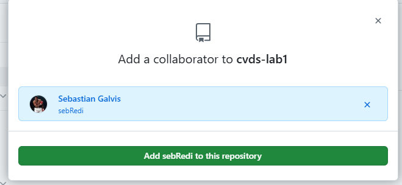
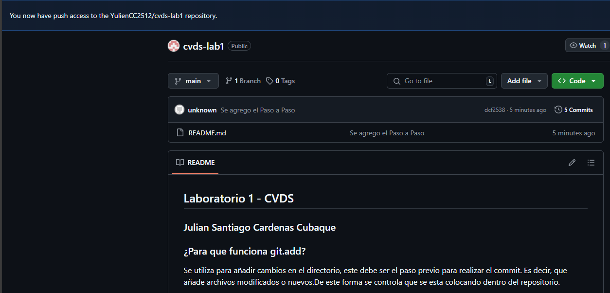
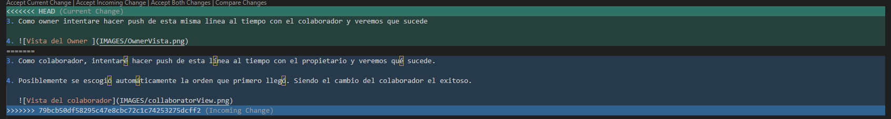
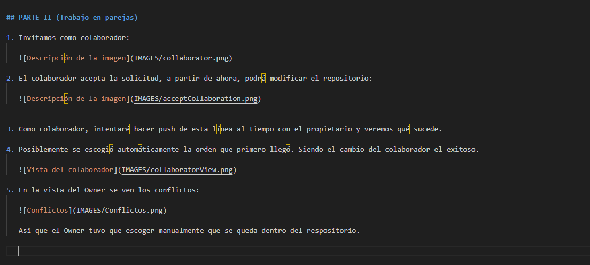

## Laboratorio 1 - CVDS 
### Julian Santiago Cardenas Cubaque

## PARTE I (Trabajo Individual).

### ¿Para que funciona git.add?
Se utiliza para añadir cambios en el directorio, este debe ser el paso previo para realizar el commit. Es decir, que añade archivos modificados o nuevos.De este forma se controla que se esta colocando
dentro del repositorio.

### ¿Para que sirve git commit -m ?

El commit es la accion de guardar los cambios dentro del repositorio. Un ejemplo puede ser que se toma la foto del estado actual del proyecto. Cuando se usa -m "message" se agrega una descripcion
o texto que usualmente debe contener la informacion de que fue lo que se actualizo. Al mismo tiempo, funciona forman un historial de versiones del repositorio. 

### PASO A PASO 

1. Se crea un archivo README.md
2. Usando git bash se usan las siguientes lineas de codigo para convertir el repositorio en remoto

        `git init

        git add .

        git commit -m "first commit"

        git branch -M main

        git remote add origin https://github.com/YulienCC2512/cvds-lab1.git

        git push -u origin main
        `

## PARTE II (Trabajo en parejas)

1. Compañeros:
   - Julian Santiago Cardenas Cubaque
   - Sebastian Galvis Briceño

2. Invitamos como colaborador: 

   

3. Enlace Enviado

4. El colaborador acepta la solicitud, a partir de ahora, podrá modificar el repositorio:

   

5. Como colaborador, intentaré hacer push de esta línea al tiempo con el propietario y veremos qué sucede.

6. Posiblemente se escogió automáticamente la orden que primero llegó. Siendo el cambio del colaborador el exitoso.

   

7. En la vista del Owner se ven los conflictos: 
 
   

   Asi que el Owner tuvo que escoger manualmente que se queda dentro del respositorio. 

   

.