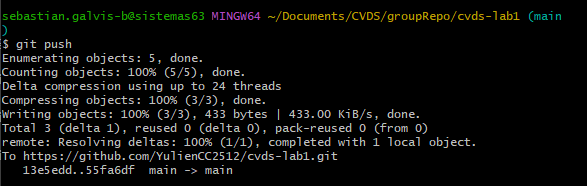

## Laboratorio 1 - CVDS 
### Julian Santiago Cardenas Cubaque


## PARTE I (Trabajo Individual).

### ¿Para que funciona git.add?
Se utiliza para añadir cambios en el directorio, este debe ser el paso previo para realizar el commit. Es decir, que añade archivos modificados o nuevos.De este forma se controla que se esta colocando
dentro del repositorio.

### ¿Para que sirve git commit -m ?

El commit es la accion de guardar los cambios dentro del repositorio. Un ejemplo puede ser que se toma la foto del estado actual del proyecto. Cuando se usa -m "message" se agrega una descripcion
o texto que usualmente debe contener la informacion de que fue lo que se actualizo. Al mismo tiempo, funciona forman un historial de versiones del repositorio. 

### PASO A PASO 

1. Se crea un archivo README.md
2. Usando git bash se usan las siguientes lineas de codigo para convertir el repositorio en remoto

        `git init

        git add .

        git commit -m "first commit"

        git branch -M main

        git remote add origin https://github.com/YulienCC2512/cvds-lab1.git

        git push -u origin main
        `


## PARTE II (Trabajo en parejas)

1. Compañeros:
   - Julian Santiago Cardenas Cubaque
   - Sebastian Galvis Briceño

2. Invitamos como colaborador: 

   

3. Enlace Enviado

4. El colaborador acepta la solicitud, a partir de ahora, podrá modificar el repositorio:

   


5. Como colaborador, intentaré hacer push de esta línea al tiempo con el propietario y veremos qué sucede.

6. Posiblemente se escogió automáticamente la orden que primero llegó. Siendo el cambio del colaborador el exitoso.

   

7. En la vista del Owner se ven los conflictos: 
 
   

   Asi que el Owner tuvo que escoger manualmente que se queda dentro del respositorio. 

   

8. Como colaborador, intentaré hacer otro push de esta línea al tiempo con el propietario y veremos qué sucede.

9. Para este punto se realizo un intento de push al mismo tiempo , los conflictos resultantes pueden resultantes pueden ser evidenciados
   de la siguiente forma en IntelliJ.

   


   IntelliJ ofrece una opcion practica como se puede ver en la siguiente imagen, en la cual se realiza una comparacion entre los dos commits
   y se escoge manualmente una version.

   
<<<<<<< HEAD


## PARTE III

1. El uso de ramas ayuda a evitar conflictos en el repositorio Una rama es una línea paralela de desarrollo. Por defecto, todos los 
   repositorios comienzan con una rama llamada main. Las ramas permiten trabajar en funcionalidades, arreglos de errores o experimentos 
   sin afectar la rama principal.
   Es posible crear una rama de la forma:
   ```git
   git checkout -b nueva-funcionalidad
   ```
   Será necesario mantener la rama sincronizada con la rama base para incluir los cambios que otros hayan hecho, usando
   ```git  
   git checkout main
   git pull origin main
   git checkout nueva-funcionalidad
   git merge main
   ```


2. ¿Que es y como funciona el Pull Request?

   Es una solicitud para fusionar cambios que realizados dentro de un repositorio en diferentes ramas, su funcion principal
   es permitir que los miembros del equipo tengan un control del trabajo individual de cada uno antes de se fusiones
   y se ubique dentro de la rama principal. Permitiendo a cada integrante corregir realizar cambios sin afectar la rama
   principal.

   Para utilizar esta funcionalidad se debe crear un rama en la cual se desarrollan los cambios , en la cual se desarrola 
   el trabajo independientemente para posteriormente realizar un pull request en donde se solicita integrar los cambios a 
   la rama principal permitiendo realizar cambios o fusionar el codigo. Finalmente, se cierra el pull request.

